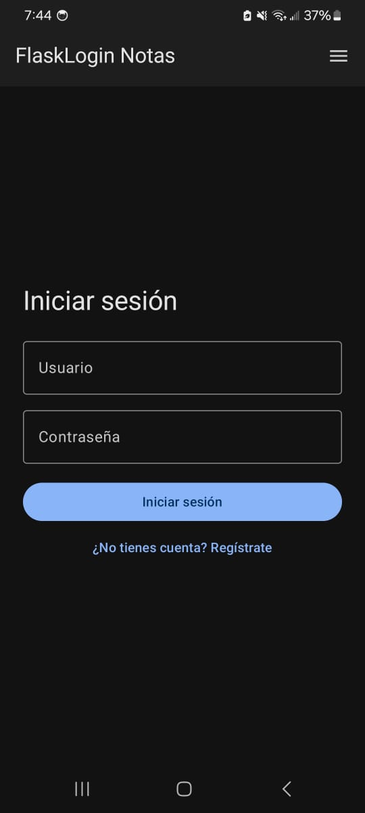
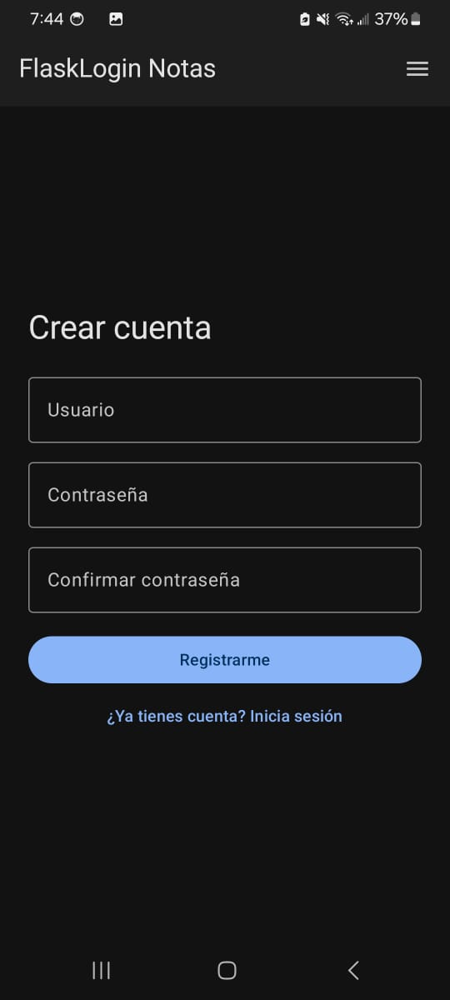
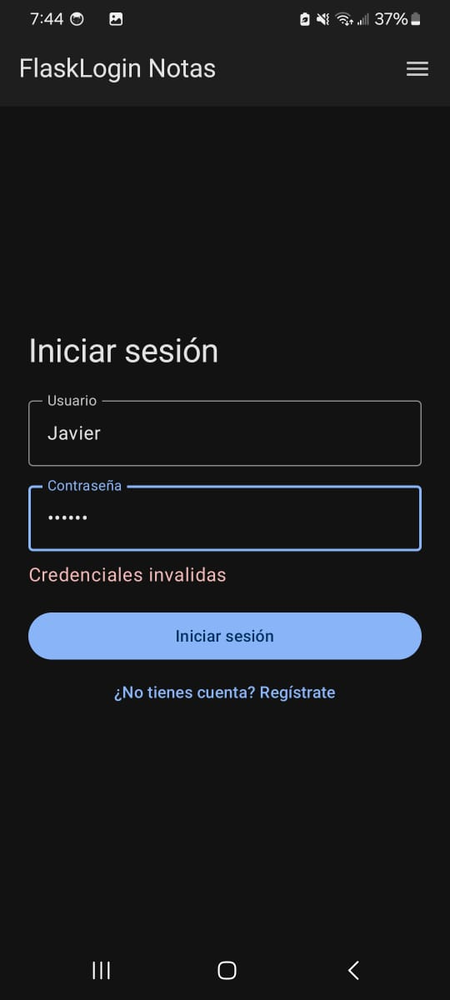
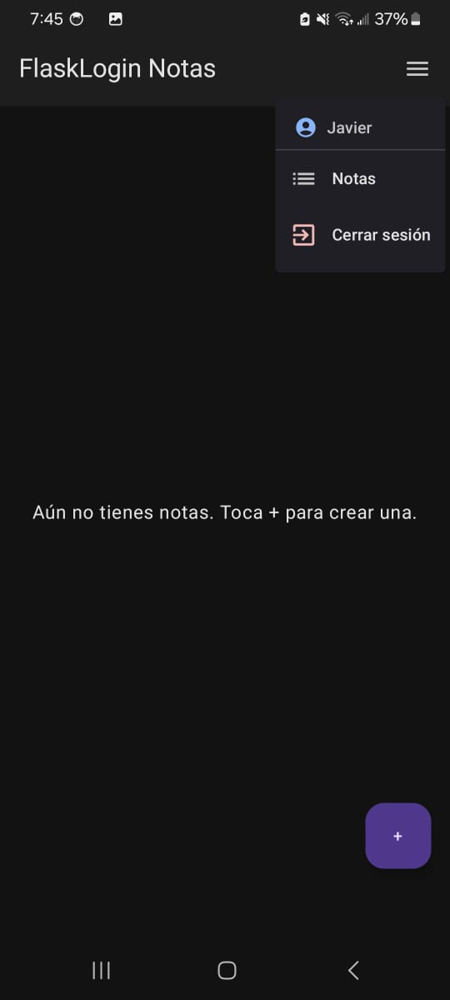
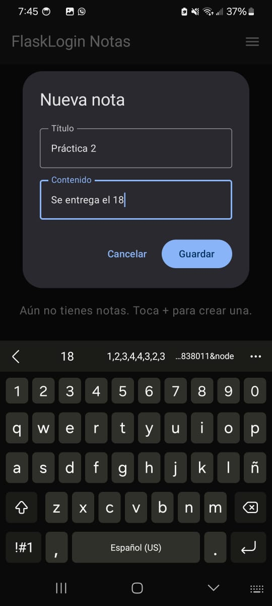
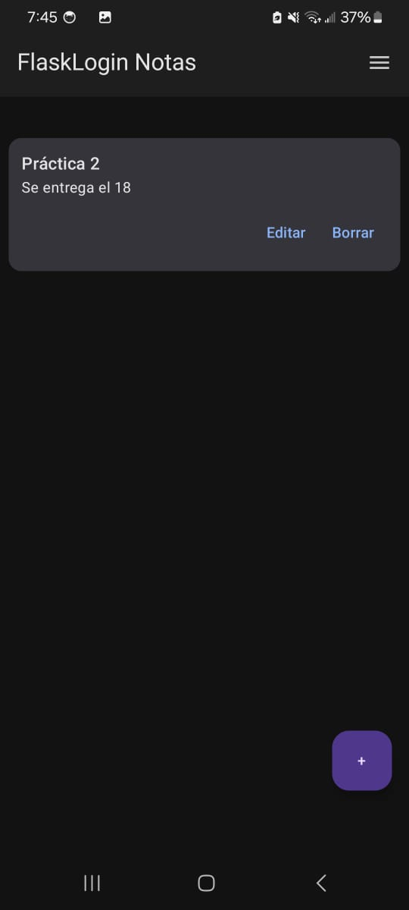
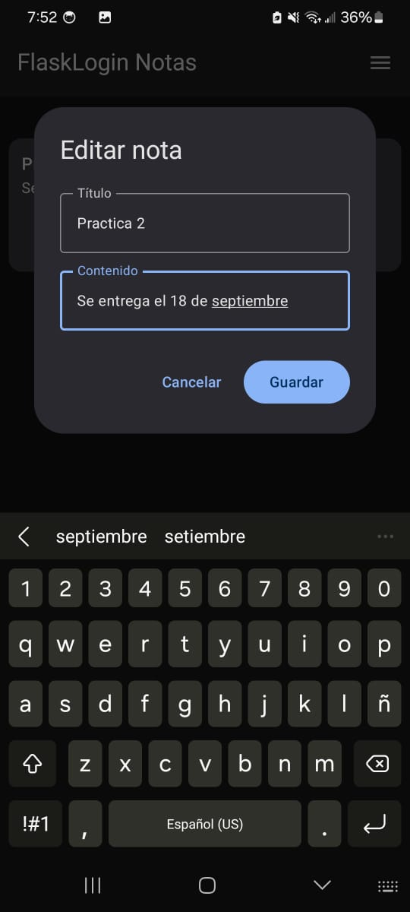
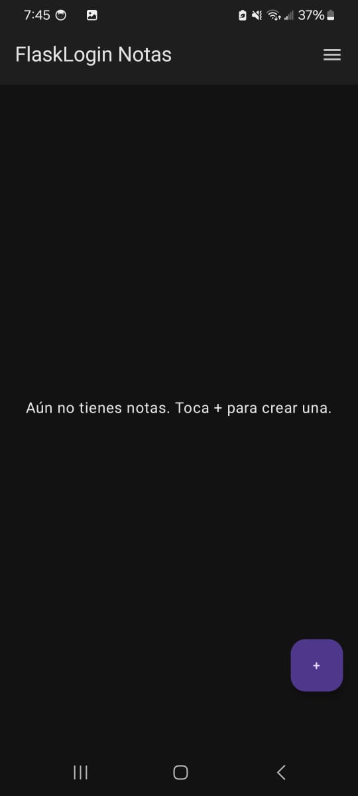

# Práctica 2 — Aplicación móvil básica para operaciones CRUD con un servicio REST

## Portada

- **Nombre completo:** Javier de Jesús Gamez Rosas
- **Número de boleta:** 2022630007
- **Grupo:** 7CV4
- **Asignatura:** Desarrollo de aplicaciones móviles nativas
- **Profesor:** Gabriel Hurtado Avilés
- **Fecha de entrega:** 18 de septiembre de 2026

---

## Uso del repositorio de ejemplo

Este proyecto **parte del repositorio de ejemplo** proporcionado por el profesor: [Flask-Compose-Login-API](https://github.com/gabrielhuav/Flask-Compose-Login-API), el cual se hizo fork/clone tal como indica la práctica. A partir de ese punto de partida se agregó todo lo necesario para cumplir la especificación completa. En concreto:

**Archivos que ya traía el ejemplo y se modificaron:**
- `Docker-Flask/ORM/app.py` — se reescribió para migrar de SQLite a Postgres, agregar JWT y el CRUD de notas.
- `Docker-Flask/ORM/requirements.txt` — se agregaron `psycopg2-binary` y `pyjwt`.
- `Docker-Flask/ORM/docker-compose.yml` — se agregó el servicio `db` (Postgres) junto al servicio `web` existente.
- `Docker-Flask/ORM/curl.txt` — se actualizó con ejemplos de los nuevos endpoints.
- `Android/FlaskLogin/app/src/main/AndroidManifest.xml` — se agregó el permiso `INTERNET` y `usesCleartextTraffic`.
- `Android/FlaskLogin/app/build.gradle.kts` y `gradle/libs.versions.toml` — se agregaron las dependencias de Retrofit, OkHttp, Navigation Compose y DataStore.
- `Android/FlaskLogin/.../MainActivity.kt` — se reescribió por completo: pasó de mostrar un `"Hello Android"` a implementar la navegación de toda la app.

**Archivos nuevos agregados por nosotros:**
- `Docker-Flask/ORM/db/Dockerfile` — Dockerfile de Postgres 17 proporcionado por el profesor como referencia, integrado como servicio de base de datos.
- `Docker-Flask/ORM/.env.example` y `Docker-Flask/ORM/.gitignore` — manejo de secretos por variables de entorno.
- Todo el paquete `data/` de la app Android (modelos, `ApiService`, `RetrofitInstance`, `SessionManager`).
- `ui/AppViewModel.kt` y `ui/screens/` (`LoginScreen.kt`, `RegisterScreen.kt`, `NotesScreen.kt`).
- Carpeta `docs/` con las capturas de pantalla de esta documentación.

Entregar el ejemplo sin cambios se considera práctica no realizada; por eso se documenta explícitamente qué se tocó.

---

## Introducción

La práctica consiste en una aplicación móvil (Kotlin + Jetpack Compose) que consume un servicio REST propio para autenticarse y para administrar un recurso mediante operaciones CRUD completas. El recurso elegido son **Notas** (`title`, `content`), donde cada nota pertenece al usuario autenticado que la creó.

**Stack elegido y justificación:**

- **Backend:** Flask (Python) + Flask-SQLAlchemy + Flask-Bcrypt + PyJWT, sobre **PostgreSQL 17**. Se mantuvo Flask porque ya era la base del repositorio de ejemplo y es válido según el enunciado ("no es obligatorio usar Spring Boot ni Flask… siempre que se justifique"); se migró de SQLite a Postgres para tener un motor de base de datos real, aprovechando el `Dockerfile`/`docker-compose.yml` de Postgres que proporcionó el profesor y demostrar `docker-compose.yml` con múltiples servicios (`db` + `web`).
- **Autenticación:** contraseñas con hash + sal vía `bcrypt` (Flask-Bcrypt) y sesiones mediante **JWT** (`PyJWT`) firmado con una clave secreta y expiración configurable (1 hora por defecto), enviado como `Authorization: Bearer <token>`.
- **App móvil:** Kotlin + Jetpack Compose (Material 3), con **Retrofit + OkHttp** para el consumo HTTP, **Navigation Compose** para las pantallas (Login, Registro, Notas) y **DataStore Preferences** para persistir el token de sesión entre reinicios de la app.

---

## Desarrollo

### Conceptos (Ejercicio 2), en nuestras palabras

- **Docker:** herramienta que empaqueta una aplicación con todo lo que necesita para correr (código, dependencias, runtime, configuración) dentro de un contenedor aislado. A diferencia de una máquina virtual no virtualiza hardware ni un sistema operativo completo, sino que comparte el kernel del anfitrión, por lo que los contenedores arrancan casi al instante. Esto garantiza que el proyecto corra igual en cualquier máquina que tenga Docker instalado, sin importar qué versiones de Python o Postgres tenga instaladas localmente.
- **Imagen y contenedor:** la imagen es una plantilla de solo lectura (el resultado de ejecutar un `Dockerfile`); el contenedor es una instancia en ejecución de esa imagen. Un contenedor es efímero: si se borra, se pierde lo que haya escrito en su sistema de archivos interno, por eso los datos que deben persistir (como la base de datos de Postgres) se guardan en un **volumen** externo al contenedor.
- **Dockerfile:** receta de texto plano con instrucciones (`FROM`, `WORKDIR`, `COPY`, `RUN`, `EXPOSE`, `CMD`) que Docker ejecuta en orden para construir una imagen. En este proyecto hay dos: uno para el backend Flask (instala dependencias de `requirements.txt` y copia el código) y otro para Postgres (basado directamente en la imagen oficial `postgres:17`, proporcionado por el profesor).
- **docker-compose.yml:** archivo YAML que describe uno o más servicios (contenedores relacionados) y cómo se conectan entre sí: puertos publicados, volúmenes, variables de entorno y dependencias de arranque. Permite levantar (o apagar) todo el entorno —en este caso el backend Flask y la base Postgres— con un solo comando.
- **Backend / servicio REST:** programa del lado del servidor que expone su lógica de negocio como rutas HTTP. Recibe peticiones `GET`/`POST`/`PUT`/`DELETE`, valida datos, interactúa con la base de datos y regresa una respuesta en JSON junto con un código de estado HTTP que indica el resultado.
- **ORM y base de datos:** un ORM (Object-Relational Mapper), en este caso SQLAlchemy, permite representar tablas de la base de datos como clases de Python y manipular filas como si fueran objetos, sin escribir SQL a mano. Aquí la base de datos es PostgreSQL 17, corriendo en su propio contenedor.

### Endpoints

Todas las respuestas son JSON. Los endpoints de `/notes` requieren el header `Authorization: Bearer <token>` obtenido en `/login`; sin él (o con un token inválido/expirado) responden `401`.

| Método | Ruta | Auth | Descripción |
|---|---|---|---|
| GET | `/` | No | Verifica que la API está activa |
| POST | `/register` | No | Registra un nuevo usuario |
| POST | `/login` | No | Autentica y devuelve un token JWT |
| GET | `/notes` | Sí | Lista las notas del usuario autenticado |
| POST | `/notes` | Sí | Crea una nueva nota |
| GET | `/notes/<id>` | Sí | Obtiene una nota por id |
| PUT | `/notes/<id>` | Sí | Actualiza una nota existente |
| DELETE | `/notes/<id>` | Sí | Elimina una nota |

#### `POST /register`
```json
// Request
{ "username": "alice", "password": "secreto123" }

// Response 201
{ "message": "Usuario creado exitosamente" }

// Response 400 (usuario duplicado o campos faltantes)
{ "message": "El usuario ya existe" }
```

#### `POST /login`
```json
// Request
{ "username": "alice", "password": "secreto123" }

// Response 200
{
  "status": "success",
  "message": "Login exitoso",
  "token": "eyJhbGciOiJIUzI1NiIsInR5cCI6IkpXVCJ9...",
  "user_id": 1,
  "username": "alice"
}

// Response 401
{ "status": "error", "message": "Credenciales invalidas" }
```

#### `GET /notes`
```json
// Headers: Authorization: Bearer <token>
// Response 200
[
  { "id": 1, "title": "Compras", "content": "Leche y pan", "created_at": "...", "updated_at": "..." }
]

// Response 401 (sin token o token invalido/expirado)
{ "message": "Token faltante o mal formado" }
```

#### `POST /notes`
```json
// Request
{ "title": "Compras", "content": "Leche y pan" }

// Response 201
{ "id": 1, "title": "Compras", "content": "Leche y pan", "created_at": "...", "updated_at": "..." }

// Response 400
{ "message": "title es requerido" }
```

#### `GET /notes/<id>`
```json
// Response 200
{ "id": 1, "title": "Compras", "content": "Leche y pan", "created_at": "...", "updated_at": "..." }

// Response 404
{ "message": "Nota no encontrada" }
```

#### `PUT /notes/<id>`
```json
// Request (campos opcionales, solo se actualiza lo enviado)
{ "title": "Compras del finde" }

// Response 200
{ "id": 1, "title": "Compras del finde", "content": "Leche y pan", "created_at": "...", "updated_at": "..." }
```

#### `DELETE /notes/<id>`
```json
// Response 200
{ "message": "Nota eliminada" }

// Response 404
{ "message": "Nota no encontrada" }
```

### Instalación y ejecución del backend

Requisitos: tener Docker y Docker Compose instalados (Docker Desktop en Windows/Mac, o Docker Engine + plugin compose en Linux).

```bash
git clone https://github.com/Javier-Gamez/Flask-Compose-Login-API.git
cd Flask-Compose-Login-API/Docker-Flask/ORM

# Crear el archivo de variables de entorno a partir del ejemplo
cp .env.example .env
# (opcional) editar .env y cambiar JWT_SECRET_KEY / credenciales de Postgres

docker compose up --build
```

Esto construye la imagen del backend Flask y la de Postgres (basada en `postgres:17`), levanta ambos contenedores conectados por una red interna de Docker Compose, y dentro de la app Flask crea las tablas automáticamente en el primer arranque. El servicio queda disponible en `http://localhost:5000`. Verificar con:

```bash
curl http://localhost:5000/
```

Ver `Docker-Flask/ORM/curl.txt` para ejemplos completos de todos los endpoints (registro, login y CRUD de notas).

**Variables de entorno** (`Docker-Flask/ORM/.env`, no se sube al repositorio):

| Variable | Descripción | Valor por defecto |
|---|---|---|
| `POSTGRES_DB` | Nombre de la base de datos | `notesdb` |
| `POSTGRES_USER` | Usuario de Postgres | `postgres` |
| `POSTGRES_PASSWORD` | Contraseña de Postgres | `postgres` |
| `JWT_SECRET_KEY` | Clave para firmar los tokens de sesión | *(cambiar en producción)* |
| `JWT_EXP_MINUTES` | Minutos de vigencia del token | `60` |

### Decisiones técnicas

- **Postgres en vez de SQLite:** el ejemplo original usaba SQLite (un archivo local). Se migró a PostgreSQL 17 usando el `Dockerfile` y `docker-compose.yml` que proporcionó el profesor como base del servicio `db`, integrándolo junto al servicio `web` (Flask) ya existente en un único `docker-compose.yml`. Ventaja: un motor de base de datos real y un ejemplo genuino de orquestación de múltiples servicios con Compose. Desventaja: un servicio adicional que levantar (mitigado con `healthcheck` + `depends_on: condition: service_healthy`, para que Flask no arranque antes de que Postgres esté listo).
- **Volumen nombrado (`pgdata`) en vez de bind mount (`./data`):** el ejemplo del profesor usaba `./data:/var/lib/postgresql/data`. Se cambió a un volumen gestionado por Docker para evitar problemas de permisos de archivos entre Windows/Linux/Mac con los bind mounts de Postgres.
- **JWT en vez de sesiones de Flask:** se eligió un token firmado con expiración (en vez de cookies de sesión de Flask) porque es el mecanismo más directo de consumir desde un cliente móvil nativo (no hay manejo de cookies como en un navegador).

### App Android — configuración de la URL base

La URL base de la API se define en `Android/FlaskLogin/app/build.gradle.kts` como `buildConfigField("String", "BASE_URL", ...)`, expuesta en el código como `BuildConfig.BASE_URL`.

> ⚠️ **Este repositorio trae `BASE_URL` apuntando a `http://192.168.100.7:5000/`**, la IP de Wi-Fi de la máquina donde se probó la app en un **celular físico**. Esa IP es local a esa red y no funcionará en otro equipo, por lo que **debe cambiarse manualmente** según dónde se vaya a ejecutar la app:

- **Emulador de Android Studio:** cambiar `BASE_URL` a `http://10.0.2.2:5000/`. `10.0.2.2` es la dirección con la que el emulador alcanza el `localhost` de la máquina anfitriona; `localhost` dentro del emulador apunta al propio emulador, no a la PC.
- **Dispositivo físico en la misma red Wi-Fi que la PC con Docker:** cambiar `BASE_URL` por la IP local (LAN) de esa PC — verificar con `ipconfig` (Windows) o `ip addr`/`ifconfig` (Linux/Mac), por ejemplo `http://192.168.1.100:5000/`.

En ambos casos el cambio se hace editando el valor de `buildConfigField("String", "BASE_URL", "\"...\"")` en `Android/FlaskLogin/app/build.gradle.kts` y volviendo a compilar/sincronizar el proyecto en Android Studio.

El `AndroidManifest.xml` declara `<uses-permission android:name="android.permission.INTERNET" />` y `android:usesCleartextTraffic="true"` en `<application>`, necesario porque durante el desarrollo la API se consume por HTTP simple (sin TLS).

### Capturas de pantalla

Flujo completo probado en un **celular físico** conectado por Wi-Fi al backend levantado con `docker compose up --build` (ver la nota sobre `BASE_URL` más arriba).

**Pantalla de inicio de sesión**



**Registro de usuario**



**Inicio de sesión con credenciales incorrectas (401)**



**Menú desplegable con la sesión iniciada**



**Crear nota (CREATE)**



**Nota creada (READ / listado)**



**Editar nota (UPDATE)**



**Nota eliminada (DELETE)**



### QA / verificación de seguridad

- Contraseñas nunca se almacenan en texto plano: se verificó en la base de datos que la columna `password` de `User` contiene únicamente el hash de bcrypt.
- Se probó `GET /notes` sin header `Authorization` y con un token inválido/manipulado: en ambos casos la API responde `401`, verificado tanto por `curl` como desde la app (mensaje "Sesión expirada, vuelve a iniciar sesión").
- Se probó login con contraseña incorrecta: responde `401` con `{"status": "error", "message": "Credenciales invalidas"}`, mostrado en la UI.
- Cada nota queda asociada al `user_id` del usuario que la creó (`Note.user_id`); todas las consultas de `/notes` filtran por `user_id=current_user.id`, por lo que un usuario no puede leer, editar ni borrar notas de otro usuario aunque adivine el `id`.
- Se verificó que `docker compose down -v` seguido de `docker compose up --build` (simulando una máquina limpia) reconstruye ambos contenedores y dejan la API funcional desde cero.
- No hay contraseñas, claves ni credenciales escritas en el código fuente: todas viven en `.env` (ignorado por git), y solo se versiona `.env.example` con los nombres de las variables.

---

## Conclusiones

El mayor reto fue coordinar tres piezas que dependen entre sí (Postgres, Flask y la app Android) sin romper el punto de partida que dio el profesor: en vez de reemplazar sus archivos, se integraron como un segundo servicio (`db`) dentro del mismo `docker-compose.yml`, agregando un `healthcheck` para evitar condiciones de carrera al arrancar. Otro reto fue depurar el flujo de autenticación con JWT y el manejo de estado en Compose: durante las pruebas manuales en el emulador se detectaron dos bugs de navegación (un mensaje de error que persistía entre pantallas, y una condición de carrera al restaurar la sesión guardada en DataStore que hacía que el botón "atrás" del sistema pudiera revelar una pantalla de login obsoleta) que se corrigieron centralizando la limpieza de errores por pantalla y esperando explícitamente a que la sesión persistida termine de cargarse antes de decidir la pantalla inicial. El resultado final es una app funcional que registra, autentica y realiza las cuatro operaciones CRUD sobre notas contra un backend real dockerizado.

---

## Bibliografía

- Grinberg, M. (2018). *Flask Web Development: Developing Web Applications with Python* (2.ª ed.). O'Reilly Media.
- Docker Inc. (2024). *Docker documentation*. https://docs.docker.com/
- Docker Inc. (2024). *Compose file reference*. https://docs.docker.com/compose/compose-file/
- PostgreSQL Global Development Group. (2024). *PostgreSQL 17 Documentation*. https://www.postgresql.org/docs/17/
- Google. (2024). *Jetpack Compose documentation*. Android Developers. https://developer.android.com/jetpack/compose
- Google. (2024). *Navigation with Compose*. Android Developers. https://developer.android.com/develop/ui/compose/navigation
- Google. (2024). *Preferences DataStore*. Android Developers. https://developer.android.com/topic/libraries/architecture/datastore
- Square Inc. (2024). *Retrofit — A type-safe HTTP client for Android and Java*. https://square.github.io/retrofit/
- Square Inc. (2024). *OkHttp documentation*. https://square.github.io/okhttp/
- Jones, J. (2020). *PyJWT documentation*. https://pyjwt.readthedocs.io/
- Grinberg, M. (2024). *Flask-Bcrypt documentation*. https://flask-bcrypt.readthedocs.io/
